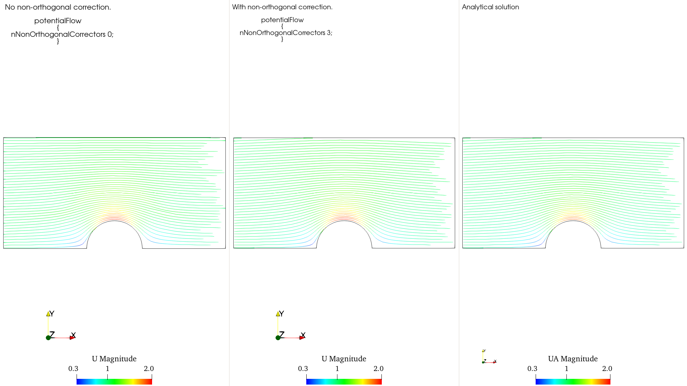
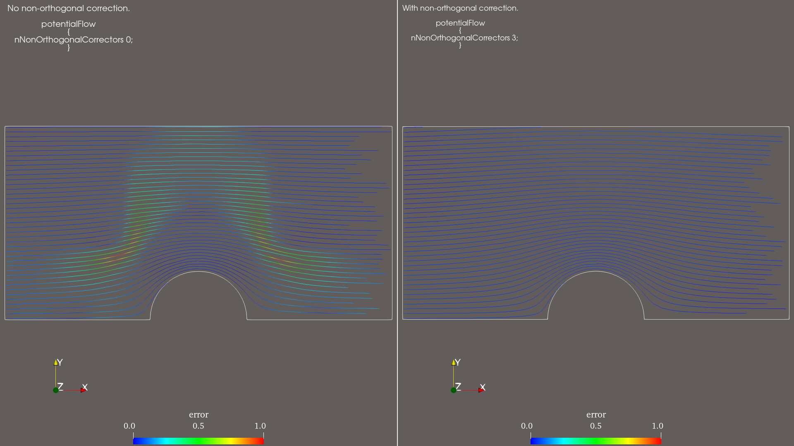
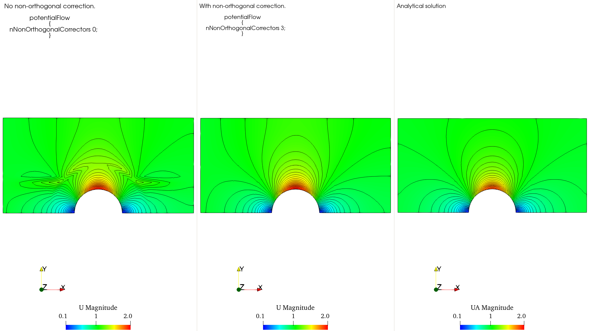
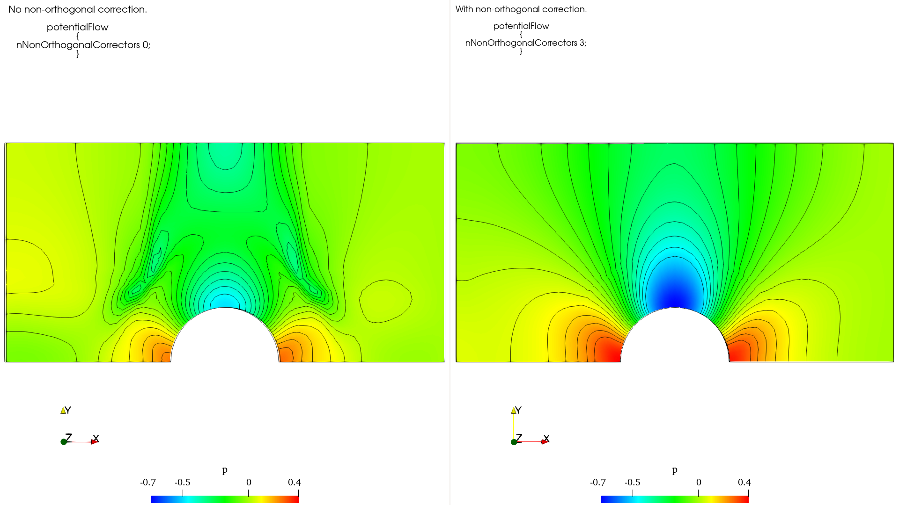

# Results

Result images are stored in `images_both_cases/`.

## Images

- Velocity-colored streamlines comparison:

<figure>
  
</figure>

<br>

- Error-colored streamlines comparison. The error is calculated in reference to the analytical solution. It is presented in gray background for better visualization:

<figure>
  
</figure>

<br>

- Velocity contour comparison:

<figure>
  
</figure>

<br>

- Pressure contour comparison:

<figure>
  
</figure>

<br>


# Flow Around a Cylinder — `potentialFoam` — blockMeshDict Explanations

OpenFOAM v2512 tutorial case based on **Tutorial 2.2: Flow around a cylinder**.
It models steady, incompressible, inviscid, and irrotational flow around a cylinder.

The principal topic documented here is the parameterized mesh definition in
`system/blockMeshDict`, especially the use of `#codeStream` to generate vertices.

## Case summary

- Solver: `potentialFoam`
- Mesh generator: `blockMesh`
- Mesh: 10 hexahedral blocks
- Model: upper half-domain with symmetry about the x-axis
- 2D representation: one cell in the z-direction
- Cylinder radius: `rInner = 0.5 m`
- Intermediate O-grid radius: `rOuter = 1 m`
- Domain limits: `x = [-2, 2] m`, `y = [0, 2] m`
- z-planes: `zmin = -0.5 m`, `zmax = 0.5 m`

## Geometric parameters

```foam
rInner  0.5;
rOuter  1;
xmax    2;
ymax    2;

zmin   -0.5;
zmax    0.5;
```

The coordinates of points on the 45° radial lines are calculated in the dictionary:

```foam
rInner45 ${{ $rInner * sqrt(0.5) }};
rOuter45 ${{ $rOuter * sqrt(0.5) }};
```

Because `sqrt(0.5) = cos(45°) = sin(45°)`, these are the x- and y-components of
points located at 45° on the inner and outer circles.

## Dynamic vertices with `#codeStream`

```foam
vertices #codeStream
{
    codeInclude
    #{
        #include "pointField.H"
    #};

    code
    #{
        pointField points({...});
        // Additional C++ code
        os << points;
    #};
};
```

`#codeStream` compiles and executes the embedded C++ while OpenFOAM reads the
dictionary. Its output becomes the value of the `vertices` entry.

- `pointField` is an OpenFOAM container of points.
- `point` is an OpenFOAM type, not a C++ keyword.
- Each `point` stores three scalar coordinates: `(x, y, z)`.
- `pointField.H` provides the required declarations.
- The initial list creates vertices `0–18` at `z = zmin`.

## Duplicating the vertices at `zmax`

```cpp
const label sz = points.size();
points.resize(2*sz);

for (label i = 0; i < sz; ++i)
{
    const point& pt = points[i];
    points[i + sz] = point(pt.x(), pt.y(), $zmax);
}
```

The code works as follows:

1. `sz` stores the original number of points: 19.
2. `resize(2*sz)` enlarges the field to 38 points.
3. `const point& pt = points[i];` creates a read-only reference to the current
   original point; no copy is made.
4. A new point is created with the same x- and y-coordinates and with `z = zmax`.
5. Vertices `19–37` duplicate vertices `0–18` on the opposite z-plane.

For example:

```text
point 0  = (x0, y0, zmin)
point 19 = (x0, y0, zmax)
```

Finally:

```cpp
os << points;
```

writes the complete `pointField` in OpenFOAM list format as the generated
`vertices` entry.

## Removing temporary variables

```foam
#remove ( "r(Inner|Outer).*" "[xy](min|max)" )
```

This removes helper entries that are no longer needed:

```text
rInner, rOuter, rInner45, rOuter45, xmax, ymax
```

`zmin`, `zmax`, and the mesh-division parameters remain because they are used later
in the `edges` and `blocks` definitions.


##  Running and comparing the non-orthogonal correction cases

Two copies of the original cylinder case were created to preserve both numerical solutions:

```bash
cp -a cylinder nNonOrtho0
cp -a cylinder nNonOrtho3
```

The cases differ only in the `potentialFlow` sub-dictionary of `system/fvSolution`.

For `nNonOrtho0`:

```foam
potentialFlow
{
    nNonOrthogonalCorrectors 0;
}
```

For `nNonOrtho3`:

```foam
potentialFlow
{
    nNonOrthogonalCorrectors 3;
}
```

Each case was cleaned and executed using the supplied scripts:

```bash
./Allclean
./Allrun
```

The scripts restore the initial fields, generate the mesh with `blockMesh`, run `potentialFoam`, evaluate the analytical velocity field `UA` and the relative error field, and calculate the numerical stream function.

### ParaView note

The solution is written into the `0/` directory rather than into a new time directory. Therefore, after opening the case with:

```bash
paraFoam
```

the **Skip Zero Time** option must be unchecked in the OpenFOAM reader properties. Otherwise, the generated fields stored in `0/` are hidden.

The relevant fields are:

- `U`: numerical velocity.
- `UA`: analytical velocity.
- `error`: relative velocity error.
- `streamFunction`: numerical stream function.

### Streamline visualization

Interpolate cell data to point data so the data is smoother:

```text
Filters → Alphabetical → Cell Data to Point Data
```

To reproduce the streamline plots, select the OpenFOAM reader and apply:

```text
Filters → Alphabetical → Stream Tracer
```

For the numerical solution, use:

```text
Vectors: U
Seed Type: Line
Integration Direction: Forward
```

Recommended seed-line settings:

```text
Point 1: (-1.99 0.02 0)
Point 2: (-1.99 1.98 0)
Resolution: 80
Maximum Streamline Length: 10
```

For the analytical solution, create another `Stream Tracer` using the same settings but select:

```text
Vectors: UA
```

Use identical seed locations, resolution, integration direction, camera position, and line width for all comparisons:

1. `nNonOrtho0` with `U`.
2. `nNonOrtho3` with `U`.
3. The analytical solution with `UA`.


## Reference

OpenFOAM v2512 Tutorial Guide, Section 2.2, **Flow around a cylinder**.
