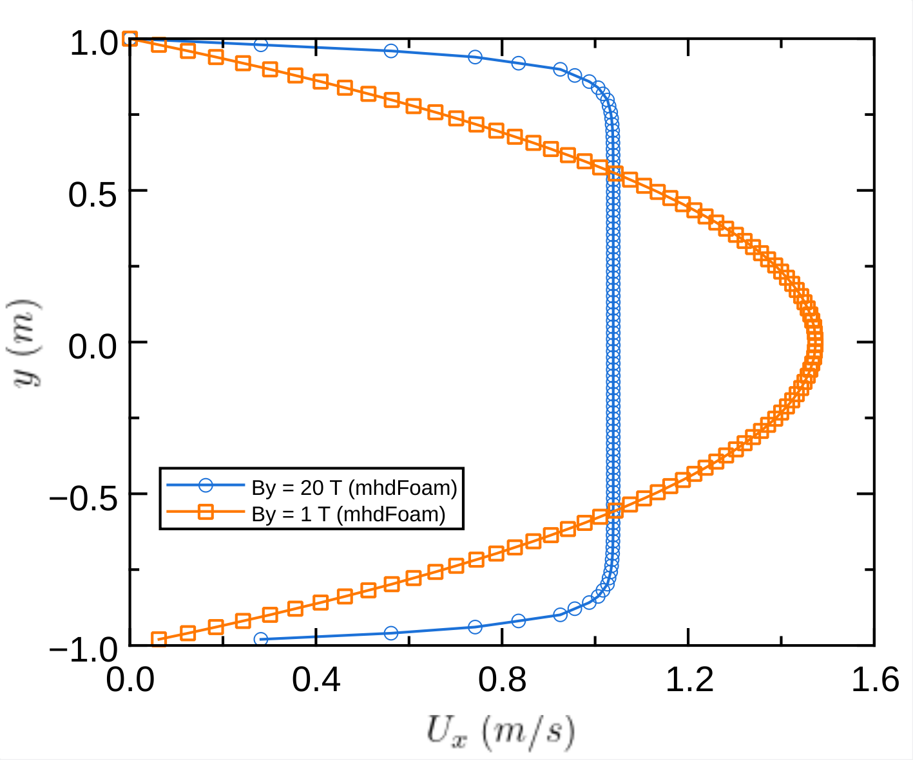

# Results

When solving with the script `./Allrun`, the x,y values for the velocity Ux profiles are stored in `/postProcessing/sample/2/line_centreProfile_Ux.xy` inside either `hartmann_M1/ ` or `hartmann_M20/`

- Plot comparing the velocity profile in the y-coordinate at the middle of the x-coordinate (x = 10 m):

<figure>
  
</figure>

 

## NOTE ON THE DIMENSIONLESS PROFILE GENERATED IN PYTHON AND OPENFOAM COMPARISON:

1. The Python script at `"cases_comparison_plot/analytical_solution.py" calculates"`:

The original formula implements the standard **dimensionless** profile, where
the velocity is normalized by the maximum center velocity: u_normalized = Ux(y) / Ux(0).
By mathematical definition, evaluating this formula at the center (y=0) yields:
[cosh(M) - cosh(0)] / [cosh(M) - 1] = 1.0
Because of this normalization, the Python script will ALWAYS return a peak value of exactly 1.0
at the center (y=0) for EVERY Hartmann number (M = 1, M = 20, etc.).

2. Why it does not match the OpenFOAM graph for M = 1:

OpenFOAM solves the physical, *dimensional* Navier-Stokes equations with MHD source terms.
Instead of fixing the peak center velocity to 1.0, OpenFOAM fixes the *average* inlet mass
flow rate (constant volumetric flux).

- For M = 1 (weak magnetic field), the fluid experiences almost no magnetic drag,
forming a highly parabolic profile. To maintain a mean velocity of 1.0 m/s across the
channel, geometry dictates that the central peak must overshoot to 1.5 m/s.

- For M = 20 (strong magnetic field), the magnetic braking flattens the profile into a
uniform "plug flow," meaning the velocity across the entire center is nearly uniform
and stays very close to the 1.0 m/s mean.

Summary: the Python script plots relative *shape* (relative to an forced peak of 1.0), whereas OpenFOAM
plots physical *magnitude* constrained by conservation of mass.
