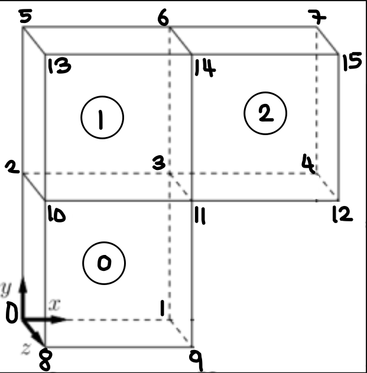
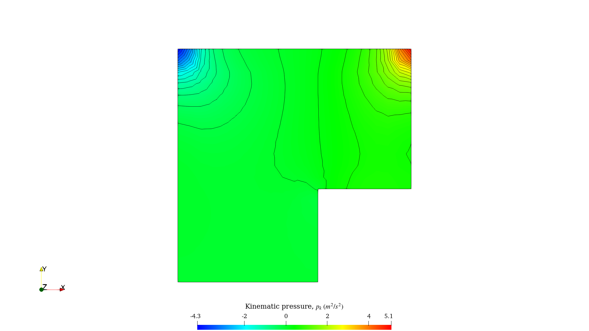
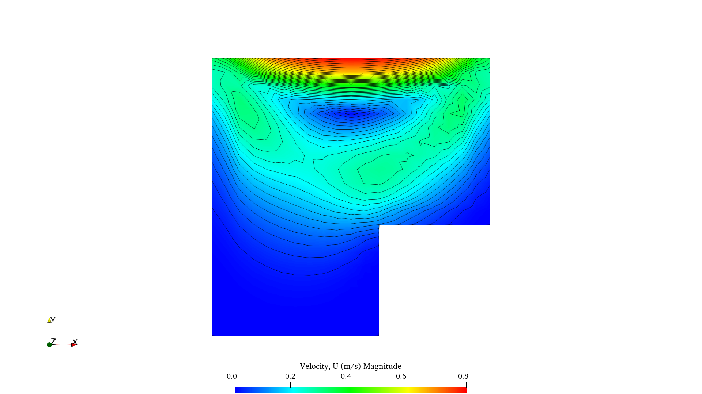
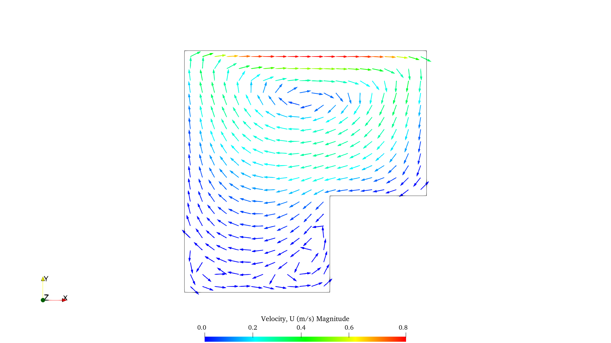
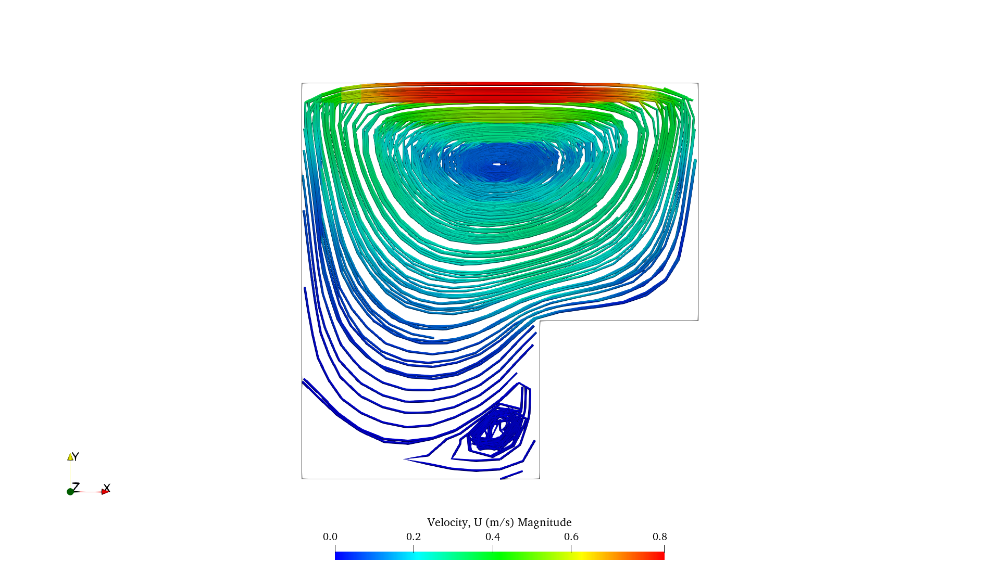

# cavityClipped (icoFoam)

## Geometry

The clipped geometry of the cavity is shown as an edited image from previous tutorials since the guide does not present the new geometry:

<figure>
    
    <figcaption>cavityClipped geometry and blocks.</figcaption>
     
</figure>

 

## Results

- Pressure contour:

<figure>
    
     
</figure>

 

- Velocity contour:

<figure>
    
     
</figure>

 

- Velocity vectors:

<figure>
    
     
</figure>

 

- Streamlines:

<figure>
    
     
</figure>

 
