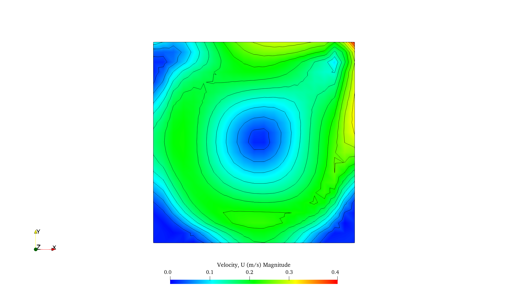
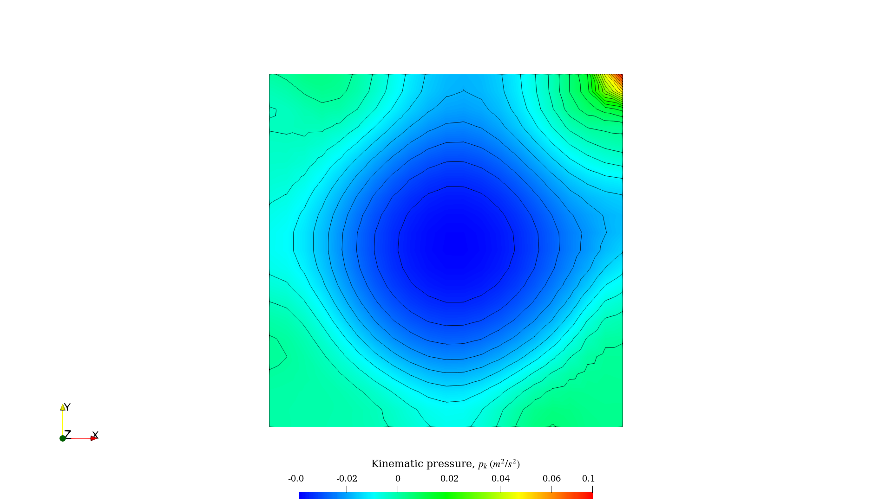
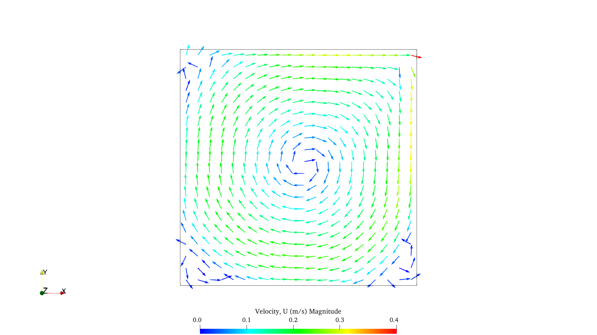
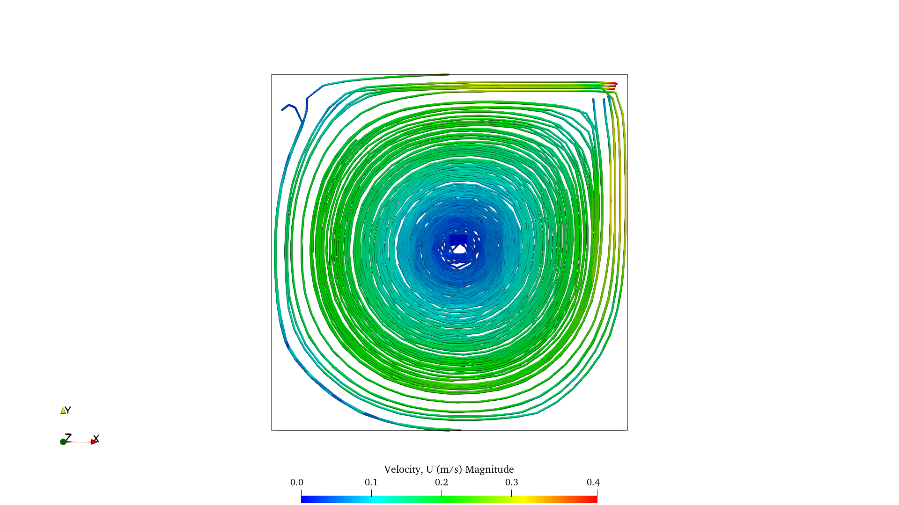

# Results

The ParaView result images are stored in `paraview_images/`. The rendered videos are stored in `paraview_images/animations/`.

## Images

<figure>
  
  <figcaption>Velocity magnitude contour at <code>t = 20 s</code>.</figcaption>
</figure>

<figure>
  
  <figcaption>Pressure contour at <code>t = 20 s</code>.</figcaption>
</figure>

<figure>
  
  <figcaption>Velocity vector field at <code>t = 20 s</code>.</figcaption>
</figure>

<figure>
  
  <figcaption>Velocity streamlines at <code>t = 20 s</code>.</figcaption>
</figure>

## Videos

GitHub does not render repository-local `<video>` tags in README files. Use the preview images below to open the `.mp4` animations. The videos do not autoplay.

[](paraview_images/animations/velocity_contour.mp4)

Velocity magnitude contour animation: [`paraview_images/animations/velocity_contour.mp4`](paraview_images/animations/velocity_contour.mp4)

[](paraview_images/animations/pressure_contour.mp4)

Pressure contour animation: [`paraview_images/animations/pressure_contour.mp4`](paraview_images/animations/pressure_contour.mp4)

[](paraview_images/animations/velocity_vectors.mp4)

Velocity vector field animation: [`paraview_images/animations/velocity_vectors.mp4`](paraview_images/animations/velocity_vectors.mp4)

[](paraview_images/animations/streamlines.mp4)

Velocity streamline animation: [`paraview_images/animations/streamlines.mp4`](paraview_images/animations/streamlines.mp4)

# `cavityRAS` tutorial: manual `pisoFoam` run with standard k-epsilon

## Purpose of this case

This case is the high-Reynolds-number lid-driven cavity tutorial solved with `pisoFoam` and a RANS turbulence model. The physical problem is a two-dimensional square cavity with a moving upper wall and stationary side/bottom walls. The run is used to learn:

- transient incompressible flow solution with `pisoFoam`;
- RANS turbulence setup using the standard `kEpsilon` model;
- turbulence initial and boundary fields (`k`, `epsilon`, `nut`);
- wall-function boundary conditions;
- OpenFOAM restart/output control;
- ParaView post-processing of velocity and pressure fields.

## Solver and model choices

- Solver: `pisoFoam`
- Flow type: incompressible, transient, isothermal
- Turbulence treatment: RANS
- Turbulence model: standard `kEpsilon`
- Main fields used by `kEpsilon`: `U`, `p`, `k`, `epsilon`, `nut`

The files `omega` and `nuTilda` are kept in the `0/` directory because they are part of the supplied tutorial template. They are not used by the standard `kEpsilon` model, but keeping them avoids modifying the original tutorial structure more than necessary.

## Note about `0.orig`, `Allrun`, and manual execution

The supplied tutorial case contains `0.orig/` instead of an initial `0/` directory. The directory `0.orig/` is a template initial-condition directory used by the tutorial scripts. For this manual learning run, the initial directory is created explicitly by copying:

```bash
cp -a 0.orig 0
```

The case also includes scripts such as `Allclean`, `Allrun`, and `Allrun-parallel`. For this learning run, the case is executed manually instead of using `Allrun`, so that each stage of the OpenFOAM workflow is visible.

## Note about the discrepancy in `epsilon`

The Tutorial Guide calculates an initial value of approximately:

```text
epsilon = 0.00189 m^2/s^3
```

based on its stated turbulence-intensity and length-scale assumptions.

The supplied v2512 tutorial case, however, uses:

```foam
internalField   uniform 0.00754;
```

in `0.orig/epsilon`. For this run, the supplied case value `0.00754` is kept to preserve consistency with the tutorial files. The difference should be interpreted as a difference in the assumed initial turbulence length scale. A separate sensitivity case can later be created using `epsilon = 0.00189` if desired.

## Runtime function objects

The large `functions` dictionary in `system/controlDict` was commented out for this learning run. The reason is that the supplied v2512 tutorial case contains many function objects that are useful for testing/demonstration, but they are not necessary for understanding the basic turbulent cavity simulation. Commenting them out keeps the run focused on the core `pisoFoam + kEpsilon` workflow and simplifies the log and ParaView output.

## Time-control setup

This run is executed from `0` to `20 s` in a single stage, without changing the time step during the run.

Recommended `system/controlDict` settings:

```foam
application     pisoFoam;

startFrom       startTime;
startTime       0;

stopAt          endTime;
endTime         20;

deltaT          0.01;

writeControl    runTime;
writeInterval   0.1;

purgeWrite      0;

writeFormat     ascii;
writePrecision  6;
writeCompression off;

timeFormat      general;
timePrecision   6;

runTimeModifiable true;
```

With `deltaT = 0.01 s` and `writeInterval = 0.1 s`, OpenFOAM saves one output every 10 time steps:

```text
0.1 / 0.01 = 10 time steps
```

This gives smooth enough post-processing in ParaView while keeping the Courant number lower than in the previous `deltaT = 0.02 s` run.

## Manual run workflow

Start from a clean case. In this run, `./Allclean` was executed before the following steps.

Go to the case directory:

```bash
cd /path/to/cavityRAS
```

Create the initial-condition directory from the supplied template:

```bash
rm -rf 0
cp -a 0.orig 0
```

Generate the mesh:

```bash
blockMesh | tee log.blockMesh
```

Check the mesh:

```bash
checkMesh | tee log.checkMesh
```

Run the solver:

```bash
pisoFoam | tee log.pisoFoam
```

Open the case in ParaView:

```bash
paraFoam
```

## Basic log checks

Check the Courant number, residuals, turbulence equations, and continuity errors:

```bash
grep -E "Time =|Courant Number|Solving for Ux|Solving for Uy|Solving for p|Solving for epsilon|Solving for k|continuity errors|bounding|nan|inf" log.pisoFoam | tail -n 120
```

A healthy run should show:

- maximum Courant number reasonably controlled;
- low velocity and pressure residuals;
- no repeated maximum-iteration warnings;
- no `nan` or `inf` values;
- no persistent bounding problems for `k` or `epsilon`;
- small continuity errors.

## ParaView post-processing notes

For pressure or velocity-magnitude contours, use a fixed color range or:

```text
Rescale to Data Range Over All Timesteps
```

This prevents apparent color jumps caused only by changing color scales.

For smoother animations, the case writes every `0.1 s`, so the saved sequence is:

```text
0, 0.1, 0.2, ..., 20
```

For vector plots, a typical ParaView pipeline is:

```text
cavityRAS.OpenFOAM -> Cell Centers -> Glyph
```

For smooth contours from cell-centered OpenFOAM data, use:

```text
Cell Data to Point Data
```

## Files intentionally kept or modified

Kept:

- `0/omega`
- `0/nuTilda`
- supplied `0/epsilon` value of `0.00754`

Modified/commented:

- the large `functions` dictionary in `system/controlDict` was commented out
- time control was changed to run from `0` to `20 s` with `deltaT = 0.01 s`
- output interval was changed to `0.1 s` of simulated time

## Exporting ParaView animations

After post-processing the `cavityRAS` case in ParaView, the animations were exported as PNG image sequences and then converted to `.mp4` videos using `ffmpeg`.

This workflow produced better results than exporting directly as `.avi` from ParaView: the final videos had better visual quality and smaller file size. The exported PNG sequences were used only as intermediate files.

The animations include:

- Velocity magnitude contour.
- Pressure contour.
- Velocity vector field.
- Streamlines.

The ParaView animations were exported with:

- Fixed camera position.
- Fixed color scale over all timesteps.
- Physical time annotation visible on screen.
- Full time range from `t = 0 s` to `t = 20 s`.
- PNG image sequence output.

The following commands were executed from:

```bash
/home/om/OpenFOAM/om-v2512/run/openfoam-learning/tutorials/incompressible/pisoFoam/RAS/cavityRAS/paraview_images
```

The following ffmpeg commands were used:

- Velocity magnitude contour:

```bash
ffmpeg -framerate 30 \
  -i animations/U_mag/U_mag.%04d.png \
  -c:v libx264 -preset slow -crf 16 -pix_fmt yuv420p \
  animations/velocity_contour.mp4
```

- Pressure contour:
```bash
ffmpeg -framerate 30 \
  -i animations/pressure/pressure.%04d.png \
  -c:v libx264 -preset slow -crf 16 -pix_fmt yuv420p \
  animations/pressure_contour.mp4
```

- Velocity vectors:
```bash
ffmpeg -framerate 30 \
  -i animations/velocity_vectors/vel_vectors.%04d.png \
  -c:v libx264 -preset slow -crf 16 -pix_fmt yuv420p \
  animations/velocity_vectors.mp4
```

- Streamlines:
```bash
ffmpeg -framerate 30 \
  -i animations/streamlines/streamlines.%04d.png \
  -c:v libx264 -preset slow -crf 16 -pix_fmt yuv420p \
  animations/streamlines.mp4
```

The main ffmpeg options are:

- -framerate 30: reads the image sequence at 30 frames per second.
- -i: location of the .png images relative to the directory where the command is executed. The pattern "%04d" means four-digit frame numbering. For example: U_mag.0000.png, U_mag.0001.png, U_mag.0002.png.
- -c:v libx264: uses the H.264 video codec.
- -preset slow: improves compression efficiency, producing smaller files at the same quality.
- -crf 16: sets high visual quality. Lower values give higher quality and larger files.
- -pix_fmt yuv420p: improves compatibility with common video players, browsers, and presentation software.
